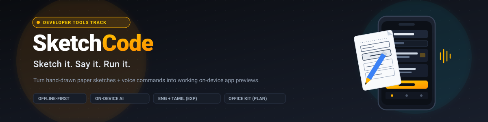
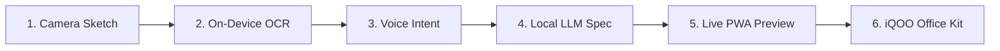

<div align="center">
  

  **Sketch it. Say it. Run it.**

  [](LICENSE)
  [](#status)
  [](#)
  [](#)
  [](#)
</div>

---

### Pitch
**SketchCode** is an on-device AI developer tool that transforms a hand-drawn paper sketch and a voice command (Tamil or English) into an interactive, working app preview—using solely an iQOO phone with zero internet, zero cloud servers, and zero API costs.

### Why This Exists
Millions of aspiring developers and students across India have smartphones but lack personal laptops, home broadband, or credit cards for cloud APIs. Software developers also experience "Red Light phases"—moments during transit or away from desks when inspiration strikes. SketchCode removes the laptop barrier, turning ideas into runnable prototypes in the creator's native language immediately on their phone.

### How It Works



---

### Sketch → Voice → Spec → App (Illustrative Example)

1. **Sketch**: User draws an input box labeled `"item"`, an `"+ Add"` button, and a checklist container on paper.
2. **Voice**: Spoken in Tamil: *"Oru grocery list app venum, item type panni Add click panna list la save aaganum."*
3. **Spec**: Generated on-device JSON specification:

```json
/* illustrative example */
{
  "appName": "Grocery Quick",
  "screens": [{
    "id": "screen_main", "title": "Grocery Quick",
    "components": [
      { "type": "navbar", "title": "Grocery Quick" },
      { "type": "input", "id": "item_input", "placeholder": "e.g., Milk 500ml" },
      { "type": "button", "label": "+ Add", "action": { "type": "add_to_list", "targetListId": "items", "sourceInputId": "item_input" } },
      { "type": "list", "id": "items", "initialItems": ["Fresh Milk", "Brown Eggs"] }
    ]
  }]
}
```

4. **App**: The phone displays a live, interactive PWA where users can type items and toggle rows dynamically.

---

### Why a Constrained UI Spec Instead of Free-Form Code

| Criterion | Free-Form Code Generation | SketchCode Constrained Spec |
| :--- | :--- | :--- |
| **Small Model (1.5B) Reliability** | High error rate; unclosed tags & broken imports | Guaranteed schema compliance; zero syntax errors |
| **Runtime Safety** | Risk of infinite loops & unsafe script evaluation | Deterministic rendering with safe, fixed components |
| **Self-Healing** | Difficult to auto-repair malformed JS on phone | Trivially linted and repaired via AST validation |

---

### Built for iQOO

| Feature | iQOO Hardware & Platform Capability |
| :--- | :--- |
| **Sketch Capture** | High-resolution camera sensor with low-latency HTML5 canvas processing |
| **Voice Processing** | Built-in microphone array with real-time 16kHz Web Audio downsampling |
| **On-Device Inference** | Snapdragon Adreno GPU accelerated via WebGPU compute shaders |
| **NPU Acceleration** | Architecture prepared for Snapdragon Hexagon NPU via WebNN standards |
| **Laptop Bridge** | Direct peer-to-peer code handoff to desktop via iQOO Office Kit |

---

### Planned Stack

| Layer | Planned Technology (Open-Source) |
| :--- | :--- |
| **Vision & OCR** | Tesseract.js (WASM) + heuristic canvas contour extraction |
| **Speech-to-Text** | Quantized Whisper-tiny via Transformers.js (Tamil & English support) |
| **Local Synthesis** | WebLLM running quantized Qwen 2.5 (1.5B) or Gemma 2 (2B) |
| **App Renderer** | Fixed deterministic React component engine packaged as a Vite PWA |
| **Desktop Sync** | iQOO Office Kit local P2P multi-device sync bridge |

---

### Roadmap

- [ ] **Milestone 1**: Core On-Device Spec Engine & Deterministic Renderer
- [ ] **Milestone 2**: Multimodal Input Pipeline (Camera OCR + Tamil/English Whisper)
- [ ] **Milestone 3**: Live Phone Preview & iQOO Office Kit Bridge

---

### Honest Limitations

- **Messy Handwriting**: OCR struggles with extreme cursive; sketches require moderately legible box contours.
- **Small-Model Reasoning**: 1.5B models cannot deduce complex business logic; apps are limited to 7 core primitives.
- **NPU Web Targeting**: WebNN support remains fragmented; WebGPU on Adreno GPU is the reliable baseline.
- **Battery & Heat**: Sustained local generation produces thermal load; generation is limited to discrete 2-second bursts.

---

### Docs Index

- [Architecture & Diagrams](docs/architecture.md) &bull; [Visual Architecture](docs/architecture.svg)
- [UI Specification Schema](docs/ui-spec-schema.md)
- [Technical Decisions (ADRs)](docs/tech-decisions.md)
- [Offline & Privacy Architecture](docs/offline-and-privacy.md)
- [Risks & Deterministic Fallbacks](docs/risks-and-fallbacks.md)
- [Roadmap & 48-Hour Build Plan](docs/roadmap.md)
- [Grand Finale Demo Script](docs/demo-script.md)
- [Phone Wireframes](docs/mockups/) ([Capture](docs/mockups/01-camera-capture.svg) | [Voice](docs/mockups/02-voice-command.svg) | [Preview](docs/mockups/03-live-preview.svg))

---

### Status
Idea and architecture only. No product code yet. The full product will be built during the Grand Finale window.

---

<div align="center">
  Designed by Priyan &bull; <a href="https://github.com/Priyan120-dev">GitHub</a>
</div>
