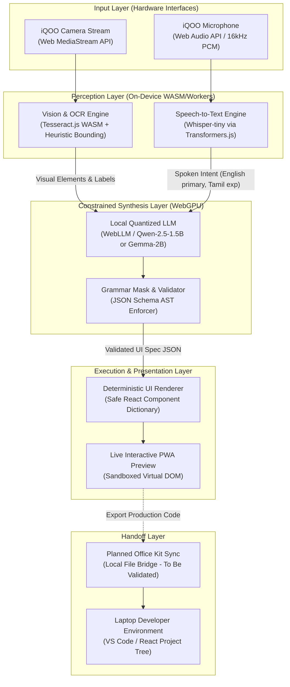
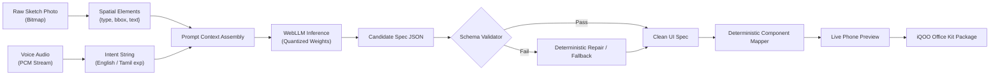
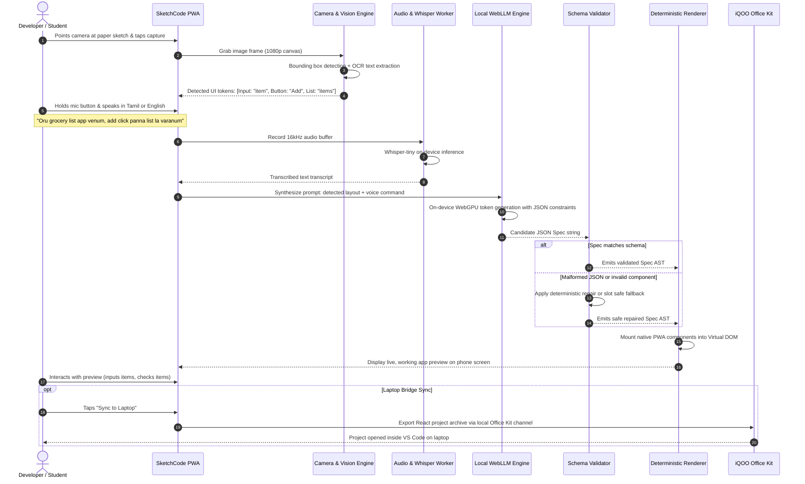

# SketchCode System Architecture

System architecture and interaction models for 100% on-device multimodal app prototyping on iQOO hardware.

**Author: Priyan**  
**Track: Developer Tools (iQOO Hackathon 2026 Grand Finale)**  
**Status: Idea and Architecture Plan (No code pre-event)**

---

## 1. High-Level Component Architecture

SketchCode operates strictly within the client sandbox. It uses on-device WebAssembly (WASM), WebGPU, and modern browser APIs. No remote cloud backend or external API is ever queried during normal generation.

---

## 2. End-to-End Data Flow

The pipeline translates non-deterministic user inputs (rough handwriting, loose speech) into a strictly deterministic JSON UI specification.

---

## 3. Sequence Diagram: One Sketch-Plus-Voice Interaction

This interaction demonstrates a user drawing a simple grocery app, speaking an instruction in Tamil or English, and inspecting the preview.

---

## 4. Component Responsibilities and Failure Modes

### 4.1 Camera Capture & Preprocessor
- **Responsibility**: Interfaces with the device camera via standard Web APIs (`navigator.mediaDevices.getUserMedia`). Performs grayscale conversion, contrast thresholding, and perspective squaring directly on an HTML5 2D Canvas.
- **Failure Mode**: Poor lighting or extreme angle tilt.
- **Handling**: Emits an on-screen alignment grid and real-time contrast warning; prompts user to retake if edge clarity drops below threshold.

### 4.2 OCR & Contour Detection (Tesseract.js + Canvas Heuristics)
- **Responsibility**: Scans high-contrast canvas contours for rectangular hulls (buttons, text inputs, cards) and runs a quantized Tesseract.js WASM worker to extract handwritten labels.
- **Failure Mode**: Messy handwriting or ambiguous sketched lines.
- **Handling**: Falls back to geometric bounding boxes with empty labels. If OCR confidence is low, sets placeholder text like `"Untitled Button"` or `"Input Field"` rather than crashing.

### 4.3 On-Device Speech Recognizer (Whisper-tiny via Transformers.js)
- **Responsibility**: Runs a quantized Whisper-tiny model inside a dedicated Web Worker using ONNX runtime WASM. Transcribes spoken English (primary) and Tamil (experimental) audio into intent text.
- **Failure Mode**: Heavy background noise, low microphone input, or mixed dialect idioms.
- **Handling**: Returns low-confidence warning. The UI allows the user to inspect the transcribed text and quickly tap quick-intent chips (e.g., `"List App"`, `"Form with Action"`) if speech recognition fails.

### 4.4 Constrained Spec Generator (Local LLM via WebLLM)
- **Responsibility**: Generates structured JSON adhering to the `ui-spec-schema`. Runs a quantized 1.5B–2B parameter model (e.g., Qwen 2.5 or Gemma 2) utilizing WebGPU hardware acceleration on the iQOO Snapdragon processor.
- **Failure Mode**: Context overflow, token repetition, or hallucinated component properties.
- **Handling**: Strict grammar masking truncates illegal tokens at generation time. Maximum token generation is capped at 512 tokens.

### 4.5 JSON Schema Validator & AST Normalizer
- **Responsibility**: Intercepts the raw LLM text stream, parses JSON, and validates all keys against the formal SketchCode UI schema. Ensures valid screen identifiers, component bounds, and permissible action handlers.
- **Failure Mode**: Trailing commas, unclosed brackets, or invalid action types.
- **Handling**: Applies regex-based JSON bracket balancing. Drops invalid attributes and replaces unsupported components with standard `<text>` or `<button>` primitives.

### 4.6 Fixed Deterministic UI Renderer
- **Responsibility**: Renders the normalized JSON AST into a sandboxed React component tree. Handles state updates (e.g., typing in an input, appending to a list, navigating between screens) through predefined, deterministic state machines.
- **Failure Mode**: Target screen not found during navigation action.
- **Handling**: Gracefully navigates to the default initial screen with a non-intrusive toast alert. Completely avoids `eval()` or dynamic code injection.

### 4.7 Planned iQOO Office Kit Bridge (To Be Validated)
- **Responsibility**: Serializes the validated UI specification into a clean, idiomatic React + Tailwind source code directory structure. Plans to explore sending the bundle over local Wi-Fi / peer-to-peer connection via the iQOO Office Kit protocol (to be validated during the Grand Finale).
- **Failure Mode**: Laptop not paired, local network disconnected, or Office Kit file handoff API unexposed to PWAs.
- **Handling**: Saves the export package locally in browser IndexedDB/Cache storage and offers a single-file zip download as the primary proven fallback.
