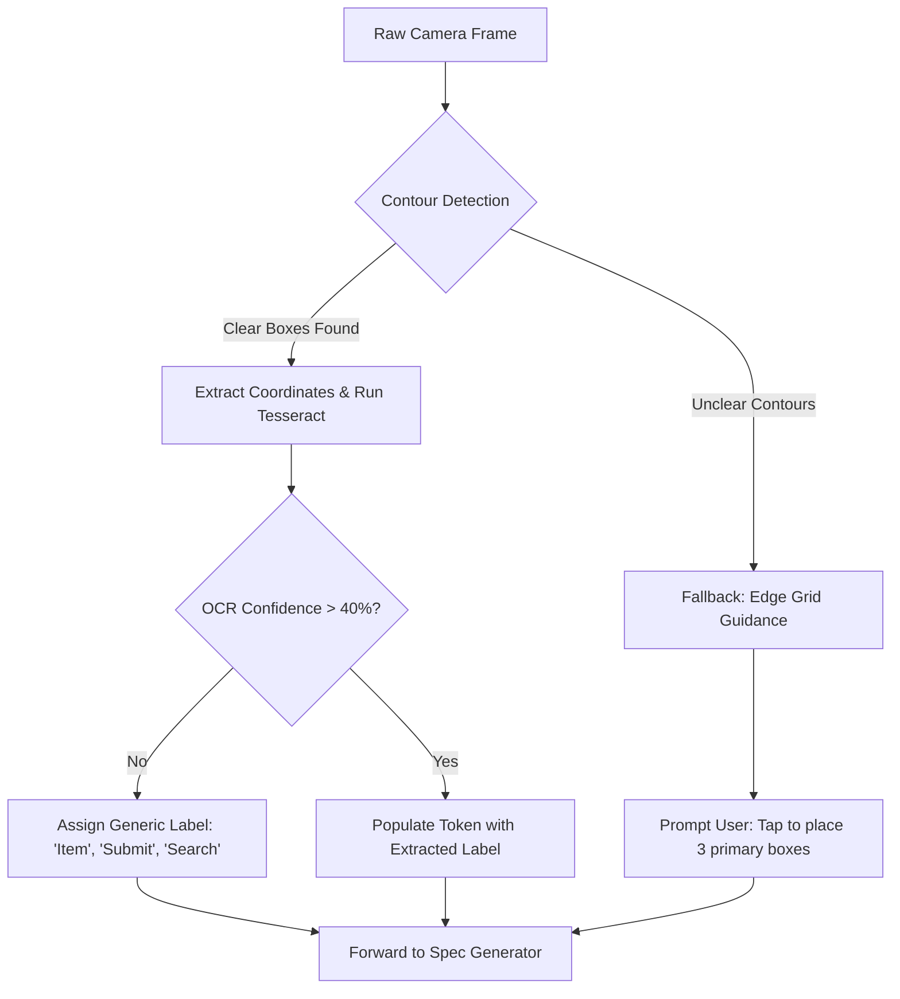

# SketchCode Risks and Fallbacks

Honest evaluation of technical constraints, risk probabilities, impacts, and deterministic fallback strategies.

**Author: Priyan**  
**Track: Developer Tools (iQOO Hackathon 2026 Grand Finale)**  
**Status: Risk Analysis & Fallback Architecture (Pre-event design)**

---

## 1. Risk Assessment Matrix

Building an entirely on-device, multimodal developer tool on mobile hardware involves real physical and algorithmic trade-offs. The table below details these risks and planned mitigations.

| Risk Area | Likelihood | Impact | Primary Mitigation | Deterministic Fallback Plan |
| :--- | :--- | :--- | :--- | :--- |
| **Handwriting OCR on Messy Sketches** | High | Medium | Grayscale contrast binarization; bounding box heuristic filtering. | If text confidence is <40%, keep the detected bounding box but insert a generic placeholder (e.g., `"Button 1"`). Let user edit label via one-tap rename. |
| **Slow Local Model Inference Latency** | Medium | High | Use quantized 4-bit weights (`q4f16_1`); restrict maximum output generation to 512 tokens. | Stream tokens progressively into an AST parser. If generation exceeds 15 seconds, offer a fast rule-based template synthesizer. |
| **Speech Accuracy in Tamil / Mixed Idioms** | Medium | Medium | English primary, Tamil experimental. Use quantized Whisper-tiny; trim background silence. | Display real-time transcription chips. If transcription is ambiguous, display 4 quick-intent buttons (e.g., `+ List App`, `+ Form`, `+ Counter`). |
| **Mobile RAM Limits & WebGPU OOM Crashes** | Medium | High | Run OCR, Whisper, and WebLLM sequentially rather than concurrently to keep peak memory <1.8 GB. | If WebGPU allocation fails, fall back to lightweight WASM CPU execution or reduce model context window to 1024 tokens. |
| **Snapdragon NPU Targeting Uncertainty** | High | Low | NPU targeting is a stretch goal; WebGPU on the Adreno GPU is the baseline. | Do not rely on experimental proprietary NPU drivers. Treat WebNN / NPU acceleration as a bonus enhancement, not a hard requirement. |
| **Thermal Throttling & Battery Consumption** | Medium | Medium | Restrict AI execution to discrete bursts (1–3 seconds per generation pass); power down workers when idle. | Prevent continuous background polling. Cap inference duty cycle; display a battery advisory if device charge is below 15%. |
| **Office Kit Sync Integration** | Medium | Low | Planned: sync project files via Office Kit (to be validated during Grand Finale). | If browser-to-Office Kit handoff is restricted, fall back to standard local .zip / project directory download. |

---

## 2. Component-Level Fallback Flows

### 2.1 Vision Pipeline Fallback
When a user submits a sketch with ambiguous handwriting, skewed perspectives, or pencil smudges:

### 2.2 Voice Processing Fallback
When ambient noise (e.g., classroom, bus stand) corrupts audio capture:

1. **Silence Detection**: If audio RMS is below threshold, the interface prompts: `"No voice detected. Tap to retry or choose an intent template below."`
2. **Intent Chips**: Four static intent presets are immediately accessible:
   - `Create a dynamic checklist`
   - `Build an input form with submit button`
   - `Create a multi-screen menu navigation`
   - `Build an item counter app`
3. **Speech-to-Text Touchup**: Users can tap directly on the transcribed transcript text box to make micro-edits before triggering spec compilation.

### 2.3 LLM Syntax and Schema Healing
When the small on-device model produces an incomplete JSON token stream:

1. **Deterministic Parser Repair**: A client-side AST linter checks for missing closing braces (`}`), square brackets (`]`), or unescaped quotes, appending them automatically.
2. **Component Dropping**: If an individual component within `screens[0].components` has an invalid structure, that single element is dropped rather than failing the entire screen.
3. **Template Default**: If the entire JSON stream is unparseable after 2 retries, SketchCode loads the canonical baseline template matching the primary detected shape (e.g., List view or Form view) and applies the OCR labels.

---

## 3. Hardware Target Strategy: GPU First, NPU Optional

- **Baseline Target**: WebGPU compute shaders executing on the Qualcomm Snapdragon Adreno GPU. This standard is universally supported in modern mobile Chromium builds and provides predictable FP16 / INT4 tensor throughput.
- **Experimental Target**: Snapdragon Hexagon NPU via emerging WebNN standards. Because WebNN implementation across mobile Android distributions remains fragmented in 2026, SketchCode designs its architecture so that NPU unavailability never breaks functionality.
